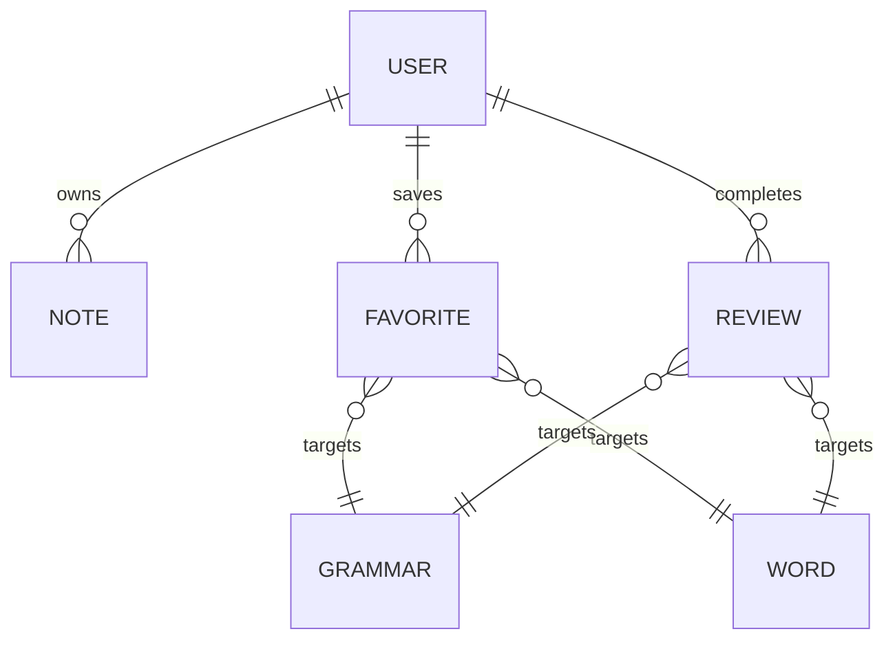

# 数据库设计

```mermaid
erDiagram
  USER ||--o{ NOTE : owns
  USER ||--o{ FAVORITE : saves
  USER ||--o{ REVIEW : completes
  FAVORITE }o--|| GRAMMAR : targets
  FAVORITE }o--|| WORD : targets
  REVIEW }o--|| GRAMMAR : targets
  REVIEW }o--|| WORD : targets
```

V1 使用六个模型：User、Grammar、Word、Note、Favorite、Review。Favorite 和 Review 的 `targetType + targetId` 是多态关联；V2 若需要更强的数据库完整性，可拆成独立关联表。
